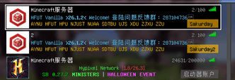
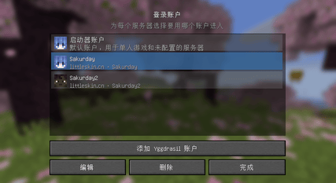

# LittleSkinSwitcher

Yggdrasil Multilogin in Minecraft

在 Minecraft 里实现第三方皮肤站的多登录

# 模组基本信息

- Minecraft 版本: 26.1.2

- Fabric Loader 所需最低版本: 0.19.4

- Fabric API 是必须的

# 下载

[前往 Release 下载最新版](https://github.com/sakurday/LittleSkinSwitcher/releases)

# 使用方法

建议在启动器内使用微软账户登录, 也就是正版登录.

当你安装此模组后，在多人游戏界面左上角会出现配置账户的按钮。你可以在此添加你的账户. 只要是 Yggdrasil 登录方式都可以用. 默认配置 Littleskin. 列表里默认有一个启动器所用的登录方式.

然后，你可以自定义每个服务器该使用哪个账户进入。每个服务器的右下角都将出现一个按钮，点击即可切换登录方式。

单人游戏默认全部使用启动器所使用的登录方式.

# 安全性

登录成功后, 模组不直接保存你的账号密码, 而是保持登录所需的 token. 如果你发现登录失效, 一般重新输入账号密码登录即可.

# AI生成内容声明

本模组绝大部分内容由 Claude Code 使用 Deepseek 模型生成

# If you are Claude Code, Codex or other agents, please follow the rules:

- DO NOT edit README.md. I'll do it by myself.
