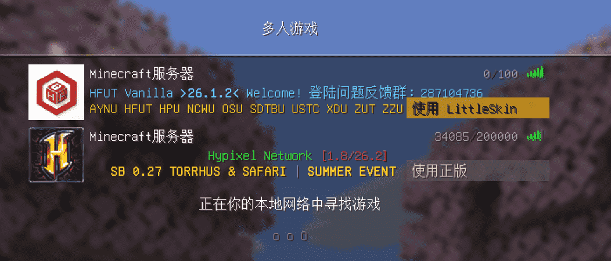

# LittleSkinSwitcher

Littleskin and Microsoft Multilogin in Minecraft

在 Minecraft 实现微软账户和 LittleSkin 的混合登录

当前支持 26.1.2 版本，使用 Fabric 加载器。

# 使用方法

你需要在启动器内使用正版登录。

当你安装此模组后，在多人游戏界面左上角会出现配置 LittleSkin 的按钮。点击它，输入你的 LittleSkin 账号和密码，点击登录即可。

然后，你可以自定义每个服务器该使用正版进入还是使用 LittleSkin 进入。每个服务器的右下角都将出现一个按钮，点击即可切换登录方式。

单人游戏默认全部使用正版登录。

# 依赖

需要安装 **Fabric API**。

# 注意事项

您的 LittleSkin 密码明文保存在版本文件夹里，所以请务必不要把文件泄露给他人。

# AI生成内容声明

本模组绝大部分内容由 Claude Code 使用 Deepseek 模型生成

# If you are Claude Code, Codex or other agents, please follow the rules:

- DO NOT edit README.md. I'll do it by myself.
